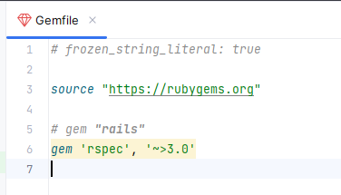

# rspec

Create a directory "rspec_prc" #directory of your own name

`mkdir rspec_prc`

switch to created directory
`cd rspec_prc`

In order to install rspec follow bellow steps
`bundle init`


`bin/respec ` Executable file will be generated as above
along with  `Gemfile`  

add `gem 'rspec', '~>3.0'` into Gemfile as below


Run `bundle binstubs respec-core` command to install gem

run `bin/rspec --init` to generate rspec files

==========================================================

Lets write a class file called bouncer 

`lib/bouncer.rb`

```
class Bouncer
  def bounce(bouncee)
    if bouncee == 'xx'
      return true
    end
    false
  end
end

```

Lets create a spec file

`spec/bouncer_spec.rb`

```
require 'bouncer'
describe 'Bouncer' do
    it 'rejects xx from entering the venue' do
        b = Bouncer.new
        bounced = b.bounce('xx')
        expect(bounced).to be_truthy
        end
end
```

Run the test

`bin/rspec` gives below like test passed results

```html
$ bin/rspec
.
Finished in 0.009 seconds (files took 0.09691 seconds to load)
1 example, 0 failures

```